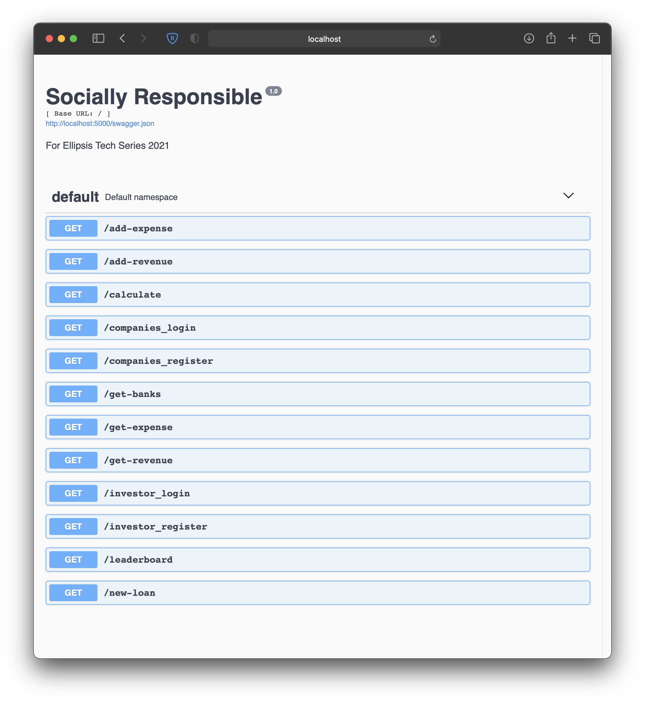
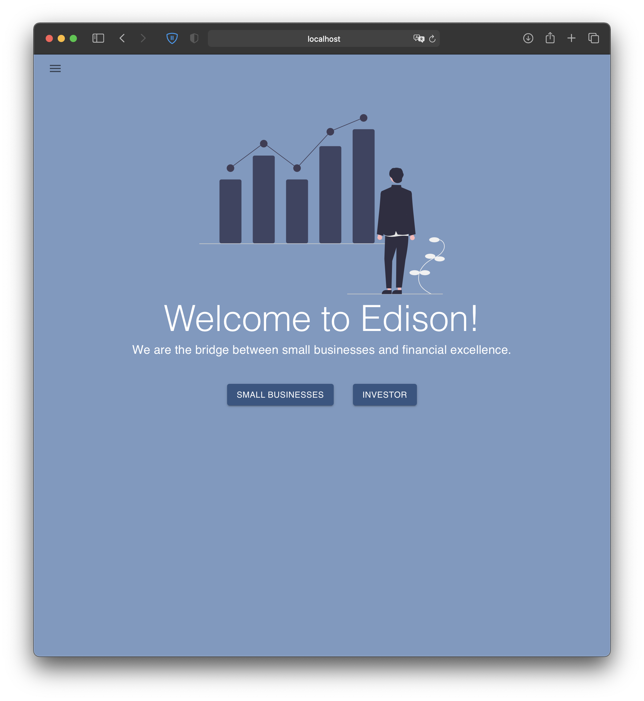
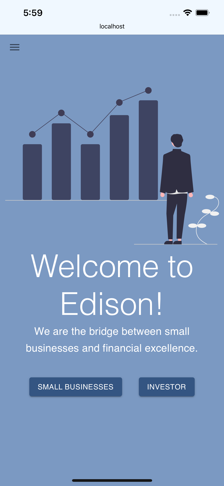

# Welcome to EDiSON, where financial equality begins

## Backend

Handled by Python running flask  
Documentation for testing routes within web browser

To start:

1. `cd ./backend/`
2. `pip install -r requirements.txt`
3. `python app.py`
4. Documentation hosted at `localhost:5000`

You should be able to see the following page pop-up

## Frontend

React JS with components from Material-UI  
[live demo](http://frontendsociallyresponsible.s3-website-us-east-1.amazonaws.com)

To start:

1. `cd ./frontend/`
2. either `yarn install` or `npm install`
3. either `yarn start` or `npm run start`
4. Frontend hosted on `localhost:3000`

Investor login details  
UEN can be any of the following `["BDS", "cbc", "BofA", "obu", "JMorgan", "SoldmanGachs"]`  
Password can be anything.

SME login details  
UEN can be anything.  
Password can be anything.

You should see the following  

## Contracts

Simple contract for recording loans.  
You need to have Ganache and Truffle installed on your local machine.

1. `truffle compile`
2. `truffle migrate`
